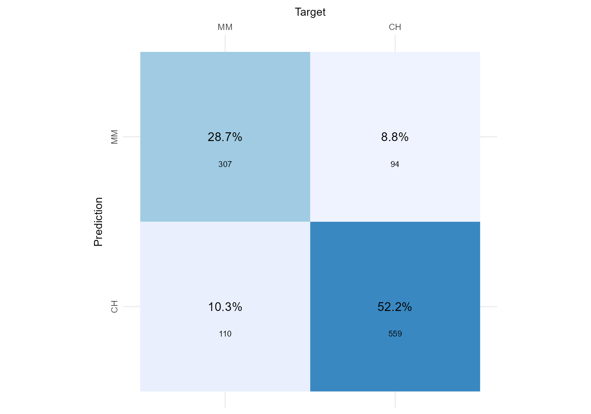
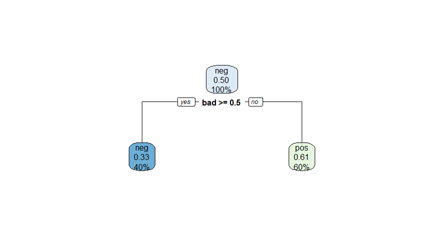
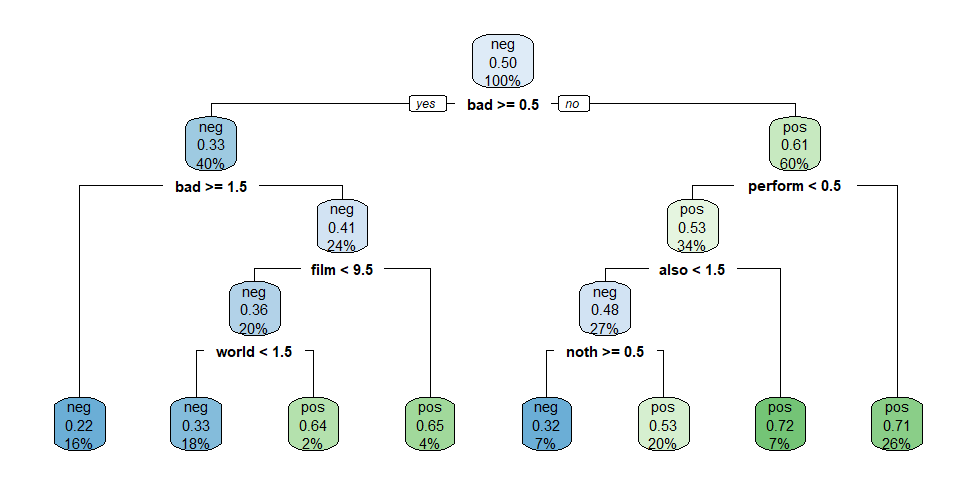

# 🆔 Identification

THIS IS AN ANONYMOUS SUBMISSION. DO NOT INCLUDE YOUR NAME NOR OTHER
PERSONAL INFORMATION ANYWHERE IN THIS FILE OTHER THAN YOUR CANDIDATE
NUMBER.

```{r}
# Complete the line below by filling it out with your CANDIDATE NUMBER

candidate_number <- 00000

```

💡 Avoid the last-minute panic. Clear your R environment and knit your
RMarkdown every once in a while to ensure your solution is compiling
correctly.

# 🎯 Exam-style questions

-   The first three questions do not require writing any R code.
-   These questions are worth 30 points and are also a taster of the
    style of the non-code questions you can expect from the January
    exam.

## Q1. Linear Regression (5 points)

What metric does Ordinary Least Square (OLS) optimise? And how does OLS
estimate regression coefficients?

> OLS optimizes the sum of squared residuals (SSR). It estimates the
> regression coefficients by minimizing the sum of squared residuals.
> This is done by finding the values of the coefficients that make the
> sum of the squared differences between the observed values and the
> predicted values as small as possible.

**✒️️ Marking Rubric: how you will be assessed**

-   What a great answer! (5/5): Not only is the explanation correct, it
    is also very clear and concise (not vague, imprecise or
    unnecessarily verbose)

-   Correct (4/5): The answer was correct

-   Partially Correct (\~3): Answer was not entirely correct or was
    confusing to read

-   Incorrect (0/5): Response was incorrect or missing

## Q2. Confusion Matrices (10 points)

The two figures below shows the goodness-of-fit of two separate
classifiers trained to predict the brand of Orange Juice sales per brand
(ISLR2::OJ). Considering we do not have a preference for a particular
brand, we want both to be identified correctly, which Classifier
performed best?

**Classifier 1** 

**Classifier 2** 

> We are taking the confusion matrix in figure1.png into consideration
> for Classifier 1. Two anticipated orange juice sales per brand,
> designated "MM" and "CH," are included in the Confusion matrix. The
> classifier generated a total of 1070 predictions, using 1070 sales of
> orange juice from each brand to determine which brand did the best.
> Our true positive rate is 0.8345324, which indicates how frequently
> the classifier correctly predicts that brand "MM" will have the
> highest orange juice sales per brand. The classifier frequently
> predicts that "MM" is not the best orange juice sales per brand, which
> is indicated by the false positive rate of 0.1699847. The rate at
> which the classifier predicts that "CH" will sell the most orange
> juice per brand is known as the true negative rate. This will be the
> same as 0.8300153. The rate at which the classifier predicts that the
> "CH" does not have the best orange juice sale per brand is known as
> the false negative rate. This is the same as 0.1129296. The
> "classifier 1" accuracy refers to how frequently the classifier gets a
> prediction right. The answer is 0.8317757.

> The precision of "classifier 1" is 0.7581699, which is the rate at
> which it predicts that "MM" will have the highest orange juice sales
> among the two brands. "Classifier 2" is also used to forecast the
> sales of "MM" and "CH" orange juice, with a total of 1070 units. Its
> accuracy in predicting that "MM" will have the highest sales is
> 0.8093458. The true positive rate for "MM" sales is 0.736211,
> indicating the frequency with which it is considered to have the best
> sales. The false positive rate for "MM" sales, or the rate at which it
> is predicted to have below average sales, is 0.143951. The true
> negative rate for "CH" sales, or the rate at which it is predicted to
> have the best sales, is 0.856049. The false negative rate for "CH"
> sales, or the rate at which it is predicted not to have the best
> sales, is 0.1800327. To determine the best classifier, we can compare
> the accuracy values of both classifiers. The accuracy of "classifier
> 1" is 0.8317757, while the accuracy of "classifier 2" is 0.8093458.
> Since "classifier 1" has a higher accuracy value, it is considered the
> better classifier.

**✒️️ Marking Rubric: how you will be assessed**

-   What a great answer! (10/10): Not only is the explanation correct,
    it is also very clear and concise (not vague, imprecise or
    unnecessarily verbose)

-   Correct (\~7/10): The answer was correct

-   Partially Correct (\~5/10): Answer was OK but it was a bit confusing
    to read

-   Partially Correct (\~3/10): Answer was not entirely correct or was
    confusing to read

-   Incorrect (0/10): Response was incorrect or missing

## Q3. Decision Trees (15 points)

For this question, we used the
`quanteda.textmodels::data_corpus_moviereviews` corpus. This dataset
consists of 2000 movie reviews and we have a target variable, called
`sentiment`. The dataset is quite balanced, we have 1000
`sentiment="yes"` (indicating a positive sentiment towards the movie),
the other 1000, `sentiment="no"`, indicating a negative review.

We trained two separate decision trees, one with `tree_depth=1` and
another with `tree_depth=4`, on this dataset. As you probably know, the
figures below depicts the fitted trees, and it contains useful
information about how well the models fit the training data. Here is
what we want from you: based on the information contained in these
figures, calculate the F1-score of each model for the target variable
`sentiment="yes"`, explain how you calculated the scores and indicate
which of the two models performed better.

**Decision Tree Model 1** 

**Decision Tree Model 2** 

> The F1-score is a useful metric that takes both recall and precision
> into account. It is calculated as the harmonic mean of recall and
> precision. To analyze the decision trees, we will first consider
> "Decision Tree Model 1." Recall is calculated as the true positive
> divided by the sum of the true positive and false negative, and is a
> measure of correct positive predictions in relation to the total
> number of actual positive cases. Precision is calculated as the true
> positive divided by the sum of the true positive and false positive,
> and is a measure of correct positive predictions in relation to the
> total number of positive predictions. Therefore, the F1 score is
> calculated as 2 \* (precision \* recall) / (precision + recall).

> Looking at dt_figure1.png, the true positive is 0.33 and the false
> positive is 0.61. The value for the false negative will be 0.33.
> Calculating the recall and precision, we have recall = 0.3510638 and
> precision = 0.3510638. So, the F1 score will be 0.3510638. For the
> second model, "Decision Model 2," we consider dt_figure2.png. The true
> positive for this model, indicating how well the model fits the data,
> is 0.22, the false negative is 0.32, and the false positive is 0.65.
> Calculating the precision and recall, we find that the precision is
> 0.2528736, while the recall is 0.4074074. Therefore, the F1 score is
> 0.3120568. Since this F1 score is lower than the F1 score for the
> first model, it indicates that the first model is a better model than
> the second.

**✒️️ Marking Rubric: how you will be assessed**

-   What a great answer! (15/15): Not only your answer was correct, it
    was very clear and engaging! You correctly explained how you
    calculated the F1-score and it was clear if and how one model was
    better than the other.

-   Correct (12/15) You correctly explained how you calculated the
    F1-score and it was clear if and how one model was better than the
    other.

-   Partially Correct (\~8/15): You reached the correct F1 scores but
    your solution was a bit vague or imprecise.

-   Partially Correct (\~5/15): Even though you reached the correct F1
    scores, you did not explain how you calculated the scores
    satisfactorily.

-   Incorrect (0): Response was incorrect or missing

# ⚙️ Setup to coding questions

Your goal will be to conduct quantitative text analysis using
unsupervised learning techniques on a selected dataset.

**This time, you will be responsible for organising your own code!** You
will see all the instructions below together with detailed marking
criteria, but you will be responsible for adding the chunks of code and
chunks of text related to your submission **at the bottom of this
document**.

## The data

We will be using a dataset called
`zeroshot/twitter-financial-news-topic`, a dataset of finance-related
tweets. The dataset holds around 17k documents annotated with 20 labels
that were [determined manually by the
authors](https://neuralmagic.com/blog/classifying-finance-tweets-in-real-time-with-sparse-transformers/)
of the dataset.

## Your choice

Although this is not "big data", some text mining algorithms might use
quite a lot of RAM storage or can take quite some time to run. Thinking
of that, we will you give you a choice of how big of a sample you want
to work on for this problem set.

You can choose either:

Option 1) use the full dataset as is (`df`) or,

Option 2) select a subset of the data considering the following
limitations:

-   Select a few `manually_annotated_label` categories and keep only
    tweets in your selected categories.
-   Your filtered dataset must have at least 4000 tweets.

# 🎯 Questions

Now here comes the actual coding questions. Read the instructions below
(Q4-Q7) and then add your chunks of code/text at the bottom of this
document.

*(Note: Do not worry, this style of question will not feature in the
final exam, as you will not have much time to write code.)*

## Q4. Pre-processing (10 points)

*💭 It is often said that 80% of the effort and time put into a data
science project is on cleaning and pre-processing data. Because this is
a practical hands-on Machine Learning course, we cannot ignore that!*

Write code that meets the requirements below:

-   [ ] Import all libraries at the top of submission
-   [ ] Read the dataset
-   [ ] Filter the `manually_annotated_label` categories (if Option 2)
-   [ ] Build a corpus of text
-   [ ] Pre-process the tokens: remove stop words, remove punctuations,
    remove numbers. If you judge it necessary, remove more tokens.
-   [ ] Build a document-frequency matrix.

Tip: check the documentation of quanteda's `?tokens`.

Pro-Tip: Take a look at `?dfm_trim` to reduce the dimensionality of the
document frequency matrix (it can *potentially* improve the clarity of
analysis).

**✒️️ Marking Rubric: how you will be assessed**

-   Fantastic (10/10): Not only the solution ticks all the boxes, the
    code is well organised, there are no weird prints of warnings or
    unnecessary messages when importing libraries, and the candidate
    went an extra mile to check whether any extra filter should be
    applied when pre-processing the tokens.

-   Correct (\~7/10): Ticks all the boxes.

-   Partial (\~4/10): Solution was only partially correct, you forgot to
    consider a few requirements.

-   Incorrect (0/10): The code does not work as required.

## Q5. Topic Modelling (30 points)

*💭 I wonder if topics identified by topic modelling match the labels
identified manually by the author of the dataset.*

Write code that does the following:

-   [ ] Run topic modelling with k topics, where k should match the same
    number of `manually_annotated_label` categories in your dataset. In
    other words, if you are using the full dataset (Option 1), k=20.
-   [ ] Explain what each of the topics you found represent
-   [ ] Give a meaningful name to each one of the topics you found
-   [ ] Explain to what extent the topics you found match the labels
    that came with the original dataset (use tables, plots, etc.)

**✒️️ Marking Rubric: how you will be assessed**

-   Fantastic (30/30): We can see that you went an extra mile to format
    your submission. This is a complex task, involving many steps but
    you made it look easy, clear and impressive. It should be published
    somewhere! Not only the solution ticks all the boxes, the code is
    well organised, the markdown is well formatted and the explanations
    are good yet concise.

-   Correct (\~23/30): Solution ticks all the boxes.

-   Correct (\~20/30): Solution was technically correctly but you could
    have put more care into communicating your results and explanations.

-   Partial (\~15/30): Either the solution was partially correct or your
    code and explanations were a bit difficult to read (vague, overly
    verbose, complex, etc.)

-   Partial (\~10/30): Either the solution was partially correct or your
    code and explanations were very difficult to read (vague, overly
    verbose, complex, etc.)

-   Incorrect (0/10): The code does not work as required.

## Q6. Plots of topics (15 points)

Write code that does the following:

-   [ ] Select one topic to highlight
-   [ ] Create a word cloud highlighting the top words from the selected
    topic against the rest
-   [ ] Create a plot of keyness for the selected topic against the rest

Tip: Check `?quanteda.textplots::textstat_keyness` and
`?quanteda.textplots::textplot_keyness`

**✒️️ Marking Rubric: how you will be assessed**

-   Fantastic (15/15): Not only the solution ticks all the boxes, the
    code is well organised, and your plots and explanations told us an
    interesting story about the topic you selected.

-   Correct (\~10/15): Ticks all the boxes.

-   Partial (\~7/15): Either the solution was partially correct or your
    code and explanations were a bit difficult to read (vague, overly
    verbose, complex, etc.)

-   Partial (\~3/15): Either the solution was partially correct or your
    code and explanations were very difficult to read (vague, overly
    verbose, complex, etc.)

-   Incorrect (0/15): The code does not work as required.

## Q7. 2D visualisation of the dataset (15 points)

-   [ ] Produce a 2D scatter plot of the dataset (however you want)
-   [ ] Colour the dots according to the topics you found in Q5
-   [ ] Explain if/how this visualisation improved your understanding of
    the data.

**✒️️ Marking Rubric: how you will be assessed**

-   Impressive! (15/15): It is not easy to create such an interesting 2D
    representation of text data but somehow you made it. It looks like a
    piece of art.

-   Correct (\~10/15): Ticks all the boxes.

-   Partial (\~7/15): Either the solution was partially correct or your
    code and explanations were a bit difficult to read (vague, overly
    verbose, complex, etc.)

-   Partial (\~3/15): Either the solution was partially correct or your
    code and explanations were very difficult to read (vague, overly
    verbose, complex, etc.)

-   Incorrect (0/15): The code does not work as required.

------------------------------------------------------------------------

Your submission starts here. Add everything after this point.

Organise your code as you find fit, aim for clarity in communication.

------------------------------------------------------------------------

```{R}
options(warn = -1)
```

```{R}
library(tidyverse)
library(tidytext)
library(quanteda)
library(topicmodels)
library(Matrix)
library(reshape)
library(quanteda.textplots)
library(quanteda.textstats)
library(wordcloud)
```

```{R}
df <-
  read_csv("./zeroshot-twitter-financial-news-topic-recoded.csv")

# Filters the data frame to include only rows with the specified labels in the manually_annotated_label column
new_df <- df %>%
  filter(
    manually_annotated_label %in% c(
      "Dividend",
      "Earnings",
      "Energy | Oil",
      "Legal | Regulation",
      "Markets"
    )
  )

# The text of these rows is extracted and cleaned by removing URLs, excess whitespace, digits, and punctuation.
text <- new_df$text
text <- gsub("(s?)(f|ht)tp(s?)://\\S+\\b", "", text)

text <- gsub("\\s+", " ", text)
text <- gsub('[[:digit:]]+', '', text)
text <- gsub("[[:punct:]]", "", text)
text_df <- tibble(line = 1:length(text), text = text)

# The cleaned text is then tokenized into individual words and joined with the stop_words dataset to remove common English stop words. 
tidy_text_df <- text_df %>%
  unnest_tokens(word, text)

data("stop_words")
tidy_text_df <- tidy_text_df %>%
  anti_join(stop_words)

# A document-term matrix is created from the remaining words.
doc_freq_matrix<- tidy_text_df$word %>%
  dfm()
```

```{R}
#create 5 topics
# create a seed to make the model's output predictable.

doc_freq_matrix_lda <-
  LDA(doc_freq_matrix, k = 5, control = list(seed = 1))
# word_topic probabilities
# use "beta" to extract the per-topic-per-word-probabilities
doc_freq_matrix_topics <- tidy(doc_freq_matrix_lda, matrix = "beta")
# 10 most common term in each topic

doc_freq_matrix_terms <- doc_freq_matrix_topics %>%
  group_by(topic) %>%
  slice_max(beta, n = 10) %>%
  ungroup() %>%
  arrange(topic,-beta)
doc_freq_matrix_terms
```

```{R}
doc_freq_matrix_terms %>%
  mutate(term = reorder_within(term, beta, topic)) %>%
  ggplot(aes(beta, term, fill = factor(topic))) +
  geom_col(show.legend = FALSE) +
  facet_wrap( ~ topic, scales = "free") +
  scale_y_reordered()
```

```{R}
# document topic probabilities
doc_freq_matrix_documents <-
  tidy(doc_freq_matrix_lda, matrix = "gamma")
doc_freq_matrix_documents
```

> In the code chunk 4 above, we create an eight-topic LDA model using
> the LDA() function from the topicmodels package, setting k = 5 and
> setting the seeds for predictable output. This model is stored in
> doc_freq_matrix_lda, and is followed by topics probabilities stored in
> doc_freq_matrix_topics, which is the per-topic-per-word-probabilities
> using the "beta" method. We then create a dataset with the 10 most
> common words in each topic, and use visualization to understand the
> two concepts taken from the articles. For example, the most common
> words in topic 1, or "Dividend," may include "earnings," "stocks," and
> "dividend," suggesting that it represents business news or information
> related to finance.

> LDA models each document as a combination of themes, as well as
> estimating each topic as a combination of words. Using the matrix =
> "gamma" argument, we can assess the probabilities for each document
> and each topic. This creates the doc_freq_matrix_documents model with
> the "gamma" argument. These numbers represent the estimated percentage
> of words from each document that were generated by each topic. For
> instance, the model estimates that only about 12.46% of the words in
> document "text1" were generated from topic 1.

```{R}
# selecting one of the topics
# selecting topic 1
doc_freq_matrix_topic_1 <- doc_freq_matrix_topics %>%
  filter(topic == 1)

# wordcloud
doc_freq_matrix_topic_1 %>% count(term, sort = T) %>% with(
  wordcloud(
    term,
    n,
    max.words = 100,
    scale = c(2, 0.25),
    min.freq = 10,
    random.order = F,
    random.color = T,
    colors = brewer.pal(9, "Purples")[5:9]
  )
)
```

```{R}
# keyness for selected topics
tstat_topic1 <- textstat_keyness(doc_freq_matrix, target = "text1")

textplot_keyness(tstat_topic1, margin = 0.2, n = 30)
```

```{R}
# scatterplot of dataset colored words in the topic

doc_freq_matrix_topics %>%
  filter(beta >= median(beta)) %>% 
  mutate(
    topic = factor(topic),
    topic = fct_recode(
      topic,
      "Dividend" = "1",
      "Earnings" = "2",
      "Energy | Oil" = "3",
      "Legal | Regulation" = "4",
      "Markets" = "5"
    )
  ) %>%
  ggplot(aes(x = term, y = beta, color = topic)) + 
  geom_point()+
  theme(axis.text.x = element_text(
    angle = 90, vjust = 0.5, hjust = 1
  )) + 
  scale_x_discrete(guide = guide_axis(check.overlap = TRUE))
```

To create a scatterplot using the data provided, we first filter the
data to include only values that are greater than or equal to the median
of the beta value. We then create new labels by replacing the numbers
with the topics used to create the data. Finally, we use the ggplot2
package to create the scatterplot, coloring it according to the topics
and using the topics as labels. This visualization helps us understand
the relationship between different words in our topic-word matrix
created above. The different colors show which topics have used more
words compared to others. By looking at the plot, we see that the words
are evenly distributed among the topics listed on the label.
